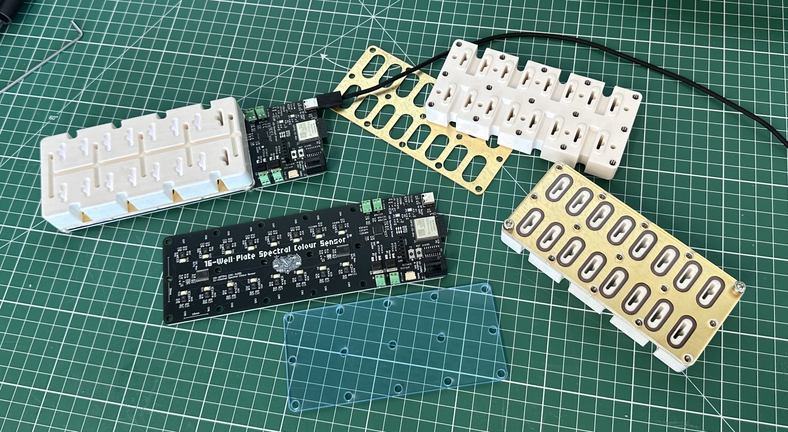

# Spectral Sensing Project

Firmware, software and PCB files for spectral colour sensing of multiple well plates in parallel.



## Quick Install

PyPi install:

```
pip install parallel-spectral-sensing-boards
```

Install from Git:

```
pip install "parallel-spectral-sensing-boards @ git+https://github.com/team-capex/n9-spectral-sensing.git@v1.0.0"
```

## Quick Start

Run a full spectral scan from the terminal, or from your own code, as shown below. A config file must be passed, containing the details of your setup.

```
spectral-run --help
```

```
spectral-run --config-path config.yaml --runs 1 --interval 10
```

```
spectral-plotter --help
```

```
spectral-plotter --csv data/spectral_log.csv --experiment-id 20260209_095600
```

***

```
from spectral_board_manager.board_manager import BoardManager

mgr = BoardManager("config.yaml")
mgr.experiment_id = "12345" # for filtering data

try:
    mgr.run()   # scans all boards simultaneously, dumps results to /data
finally:
    mgr.close()
```

## Example Config File
```
data_dir: "data"

boards:
  - board_id: "board-1"          # Must be unique
    com_port: "COM5"
    sensors_in_use: 10           # 1..16
    sensor_settings:
      gain: 2                    # 1,2,4,8
      atime: 30                  # 0..255
      astep: 600                 # 0..65535
    sample_type: "liquid"        # "solid" or "liquid" (solid => LEDs_ON true)
    control_voltage: 5.0         # 0..10, applied only during run()

  - board_id: "board-2"
    com_port: "COM6"
    sensors_in_use: 16
    sensor_settings:
      gain: 4
      atime: 20
      astep: 800
    sample_type: "solid"
    control_voltage: 8.0
```
*Note: control_voltage is applied only during active acquisition. Between runs and on shutdown, outputs are automatically returned to 0V.*

## Installation for cloned repository

### Check Python Version
**Must be python3.10 or greater**

```
python --version
```

### Install to local environment

Build venv in root directory:

```
python -m venv .venv
```

Activate venv:

```
source .venv/bin/activate
```

Update pip:

```
pip install --upgrade pip
```

Install dependencies into new venv:

```
pip install -e .
```

Verify:

```
python -c "from spectral_board_manager import BoardManager; print('OK')"
```

Note: Replace *bin* with *Scripts* if using windows.

## Flashing Firmware to PCBs (Platformio)

Install the [PlatformIO VSCode Extension](https://docs.platformio.org/en/latest/integration/ide/vscode.html) and open a new Pio terminal (found in *Quick Access/Miscellaneous*). Connect the the target PCB via USB and run the following commands:

```
cd firmware/spectral-sensor-board
```

```
pio run -t upload
```

## Introduction to AS7341 Spectral Sensor

### Frequency Bands (F1..F8)

Measured values are raw photodiode counts (ADC output after integration); not color-corrected or normalised and are extremely sensitive to:
- Illumination spectrum
- LED aging
- Distance / angle
- Surface texture

| Channel | Approx. Wavelength |
|------|------|
| F1 - Violet | ~405 nm |
| F2 - Indigo | ~425 nm |
| F3 - Blue | ~450 nm |
| F4 - Cyan | ~475 nm |
| F5 - Green | ~515 nm |
| F6 - Yellow | ~555 nm |
| F7 - Orange | ~590 nm |
| F8 - Red | ~630–680 nm |
| CLR | All visible |
| NIR | ~850–900 nm |

### CLR Signal

Measured using a broadband photodiode with no color filter, that sees almost the entire visible spectrum (and a bit beyond).
Think of it as “total visible light intensity” or a reference / normalisation channel. Why it is useful: 
- Normalise spectral channels: Fn / CLR
- Detect illumination changes.
- Improve stability across time.
- If your light source dims by 10%, all F channels drop, but CLR drops too → ratios stay meaningful.

### NIR Signal

Measured using a near-infrared photodiode (~850–900 nm). Why it is useful:
- Detect ambient contamination (sunlight vs LED).
- Correct visible channels (if NIR spikes, your visible data is probably compromised).
- Feature extraction (especially for bio / chemical systems).

## Hardware References

1. [AS7341 Spectral Sensors](https://ams-osram.com/products/sensor-solutions/ambient-light-color-spectral-proximity-sensors/ams-as7341-11-channel-spectral-color-sensor)
2. [Neutral LED Backlight](https://www.ledproff.dk/led-paneler-60x30-cm/3116-60x30-led-panel-24w-hvid-kant-8720682000144.html?_gl=1*k4gk14*_up*MQ..*_gs*MQ..&gclid=Cj0KCQiA1czLBhDhARIsAIEc7ujcU2kLfnA-ZHXxeq7G_0TSyTC9MBlyjy6_dsIIG-lkqn9Rp94GhlsaAi2VEALw_wcB&gbraid=0AAAAAo5SzqGEkNimtGc2aU2cM1jruEYBz#/34-kulor-neutral/37-daempbar-ikke_daempbar)
3. [0-10V Dimmable LED driver](https://www.ledproff.dk/led-paneler-til-indbygning/2923-meanwell-25w-350-1050ma-daempbar-lcm-25-driver-0-10v-daempbar-til-led-panel.html?_gl=1*ok31c7*_up*MQ..&gclid=Cj0KCQiA1czLBhDhARIsAIEc7ujcU2kLfnA-ZHXxeq7G_0TSyTC9MBlyjy6_dsIIG-lkqn9Rp94GhlsaAi2VEALw_wcB&gbraid=0AAAAAo5SzqGEkNimtGc2aU2cM1jruEYBz)
4. [Heating Cartridge](https://3deksperten.dk/products/spider-heater-cartridge-12v-60w)

*Note: links are provided as reference examples; equivalent components may be used.*

## Troubleshooting

- If no serial ports are found, check permissions.
- If flashing fails, ensure no Python process is holding the port.
- Maximum 9V to LCM-25 dimmable LED driver (LED panel rated for 560mA, driver gives 600mA at 10V).
- v0 PCBs require small solder job for DAC 0-10V to function (see below). Issue fixed in v0.1.


*3V3 soldered to C27 as shown*