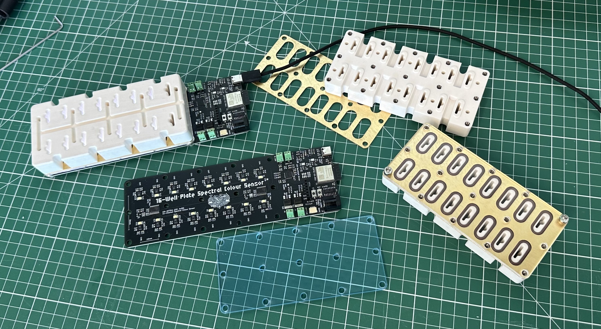

# N9 Spectral Sensing System

Automated high-throughput spectral colour sensing using an N9 robot arm, custom PCB sensor boards, a fluidic pump controller, and an electrochemical test cell.



---

## Table of Contents

1. [System Overview](#system-overview)
2. [Hardware Overview](#hardware-overview)
3. [Initial Setup](#initial-setup)
4. [Flashing Firmware to PCBs](#flashing-firmware-to-pcbs)
5. [Serial Port Configuration](#serial-port-configuration)
6. [Configuration Files](#configuration-files)
7. [Running an Experiment](#running-an-experiment)
8. [Standalone Spectral Scanning (No Robot)](#standalone-spectral-scanning-no-robot)
9. [Plotting Results](#plotting-results)
10. [Data Output](#data-output)
11. [Simulate Mode (Testing Without Hardware)](#simulate-mode-testing-without-hardware)
12. [AS7341 Sensor Reference](#as7341-sensor-reference)
13. [Troubleshooting](#troubleshooting)

---

## System Overview

The system automates the following workflow:

1. The **N9 robot arm** picks samples from holders or legacy racks and places them on spectral sensor boards.
2. **Spectral sensor PCBs** (up to 5) each measure 16 samples simultaneously using AS7341 colour sensors.
3. The **fluidic pump controller** mixes and dispenses dye solutions into sensor wells via a pipette attached to the robot.
4. **Peristaltic pumps** fill and drain the electrochemical test cell.
5. Measurement data is logged to CSV automatically.

---

## Hardware Overview

### PCBs

There are two types of custom PCBs in this system. Each runs different firmware.

| PCB | Colour | Function | Firmware project |
|-----|--------|----------|-----------------|
| Spectral sensor board | **Black** | Reads 16 AS7341 colour sensors; controls LED backlight voltage and heaters | `firmware/spectral-sensor-board/` |
| Pump controller board | **Blue** | Drives 4 stepper pumps for dye mixing; has OLED display, status LEDs, Bluetooth | `firmware/pump-controller-n9/` |

### Other hardware

- **N9 robot arm** — 4-axis SCARA robot; controlled via USB serial (FTDI)
- **Peristaltic pumps** — controlled via the N9 robot controller digital outputs (legacy wiring)
- **Electrochemical test cell** — samples inserted/retrieved by the robot; filled/drained by peristaltic pumps
- **LED backlight panel** — 24 W, 60×30 cm neutral LED; dimmed via 0–10 V signal from spectral board

---

## Initial Setup

**Requirements:** Python 3.10 or higher.

```bash
python --version   # Must be 3.10+
```

### 1. Create a virtual environment (first time only)

```bash
python -m venv .venv
```

### 2. Activate the virtual environment

On macOS / Linux:
```bash
source .venv/bin/activate
```

On Windows:
```bash
.venv\Scripts\activate
```

### 3. Install the package and all dependencies

```bash
pip install --upgrade pip
pip install -e .
```

### 4. Verify installation

```bash
python -c "from spectral_board_manager import BoardManager; print('OK')"
```

> **Note:** The `north_c9` robot library requires additional system libraries on macOS:
> ```bash
> brew install sdl2 sdl2_image sdl2_mixer sdl2_ttf
> ```

---

## Flashing Firmware to PCBs

Firmware is flashed using [PlatformIO](https://platformio.org/), which runs inside Visual Studio Code.

### Prerequisites

1. Install [Visual Studio Code](https://code.visualstudio.com/).
2. Install the [PlatformIO IDE extension](https://docs.platformio.org/en/latest/integration/ide/vscode.html) from the Extensions panel.

### Steps

1. Open this repository folder in VS Code.
2. Open the **PlatformIO terminal**: click the PlatformIO icon in the left sidebar → **Quick Access** → **Miscellaneous** → **PlatformIO Terminal**.
3. Connect the target PCB to your computer via USB.
4. Navigate to the correct firmware project for the board you are flashing:

**For the black spectral sensor board:**
```bash
cd firmware/spectral-sensor-board
pio run -t upload
```

**For the blue pump controller board:**
```bash
cd firmware/pump-controller-n9
pio run -t upload
```

> **Important:** Flash one board at a time, or specify the upload port explicitly to avoid flashing the wrong board:
> ```bash
> pio run -t upload --upload-port COM11
> ```
> On Linux/macOS the port will be `/dev/ttyUSB0` or `/dev/tty.usbserial-XXXXX` instead of `COM11`.

> **If upload fails:** Make sure no Python script is currently running and holding the serial port open. Close any running experiments before flashing.

---

## Serial Port Configuration

Each PCB communicates with the computer via a USB serial connection. You must find the correct COM port for each board and enter it in `config.yaml`.

### Finding COM ports

**Windows:** Open Device Manager → Ports (COM & LPT). Each connected board will appear as `USB Serial Device (COMxx)`.

**macOS/Linux:**
```bash
ls /dev/tty.usbserial-*   # macOS
ls /dev/ttyUSB*           # Linux
```

### Connecting multiple boards

When multiple boards are connected at once, each will have a different COM port. The spectral sensor board serial numbers are encoded in the FTDI chip — if boards are getting confused, connect them one at a time and note which port each one appears on, then set those ports in `config.yaml`.

---

## Configuration Files

### `config.yaml` — Hardware Configuration

This file describes all hardware connected to the system. Key sections:

#### `boards` — Spectral sensor PCBs

```yaml
boards:
  - board_id: "board-1"          # Must be unique; referenced in sensing_stations
    com_port: "COM11"            # Serial port (Windows: COMxx, Linux: /dev/ttyUSBx)
    sensors_in_use: 16           # How many sensors are populated (1–16)
    sensor_settings:
      gain: 64                   # AS7341 gain: 1, 2, 4, 8, 16, 32, 64, 128, 256
      atime: 255                 # Integration time (0–255); higher = longer exposure
      astep: 600                 # Integration step (0–65535)
    sample_type: "liquid"        # "liquid" or "solid" (solid turns on LEDs differently)
    control_voltage: 9.0         # LED backlight brightness (0–10 V; max 9 V for LCM-25)
    target_temp_c: null          # Set to e.g. 37.0 to enable firmware temperature control
```

#### `robot` — N9 robot arm

```yaml
robot:
  simulate: false                # Set to true to run without hardware
  safe_travel_z_mm: 200.0        # Z height (mm) used when moving between positions
  device_serial: "FT5SJ5LG"     # FTDI serial number; null = use first found
```

#### `sensing_stations` — Physical positions of sensor boards on the robot table

Each station links a board_id to robot coordinates.

#### `sample_holders` — Racks holding samples before/after the experiment

#### `legacy_sample_racks` — Older-style sample racks (11×8 grid)

#### `peristaltic_pumps` — Pump calibration (flow rate and offset per pump name)

#### `test_cell` — Electrochemical test cell position and fill/drain settings

#### `fluidic_pump_controller` — Stepper pump board settings (COM port, pipette offset)

---

### `experiment.yaml` — Experiment Definition

This file defines what experiment to run and in what order.

```yaml
experiment_id: "demo-20260331-dye-mixture-spectral-ni-ecell"
description: "..."

sensing_stations:               # Which stations to use
  - sensing-station-1
  - sensing-station-2

sample_holders:                 # Which holders to use
  - holder-1

samples:                        # Sample groups
  - sample_type: "PC"
    count: 10
    source: holder              # Where to pick from: holder, legacy_rack
    destination: pcb            # Where to place: pcb, test_cell

steps:                          # Ordered list of experiment phases
  - home_robot
  - create_mixture
  - load_from_sample_holders_to_pcb
  - start_colour_scanning
  - run_ni_test_cell_loop
  - wait_for_colour_scanning
  - return_all_to_holder
  - report_cleaning_needed
```

**Available steps:**

| Step | Description |
|------|-------------|
| `home_robot` | Move robot to home position |
| `create_mixture` | Pump dye mixture into vessel |
| `prime_mixture` | Move to waste position and prime pipette |
| `add_mixture_to_pcb` | Dispense dye into all PCB sensor wells |
| `deprime_mixture` | Retract pipette |
| `load_from_sample_holders_to_pcb` | Transfer samples from holder to PCB wells |
| `load_from_legacy_rack_to_pcb` | Transfer samples from legacy rack to PCB |
| `start_colour_scanning` | Begin background spectral scanning loop |
| `run_ni_test_cell_loop` | Cycle Ni samples through test cell (runs alongside scanning) |
| `wait_for_colour_scanning` | Wait until scanning finishes |
| `return_all_to_holder` | Return all samples to their original holder positions |
| `report_cleaning_needed` | Write a cleaning report to `data/cleaning_report.txt` |

---

### `holder_state.json` — Sample Holder Contents

Defines which samples are in which holder slots at the start of the experiment. Each entry specifies the slot position, sample type, sample ID, and initial state (`FRESH`, `EMPTY`, etc.).

You must edit this file before each new experiment to reflect the actual sample layout in the holder.

```json
{
  "holder-1": [
    {"col": 0, "row": 0, "state": "FRESH", "sample_type": "PC", "sample_id": "holder-1_c00_r00"},
    ...
  ]
}
```

### `legacy_rack_state.json` — Legacy Rack Contents

Same concept as `holder_state.json` but for the older 11×8 sample rack.

---

## Running an Experiment

Make sure the virtual environment is active, all hardware is connected, and `config.yaml` / `experiment.yaml` are correctly configured.

```bash
experiment-run --config config.yaml --experiment experiment.yaml
```

### Resuming an interrupted experiment

If the experiment was interrupted (power cut, error, etc.), it can be resumed from where it left off:

```bash
experiment-run --config config.yaml --experiment experiment.yaml --resume
```

State is automatically saved to `data/state/experiment_state.json` after each step.

### Help

```bash
experiment-run --help
```

---

## Standalone Spectral Scanning (No Robot)

To take spectral measurements without the robot (boards only), use:

```bash
spectral-run --config-path config.yaml --runs 1 --interval 10
```

| Argument | Description |
|----------|-------------|
| `--config-path` | Path to your config.yaml |
| `--runs` | Number of scan repetitions (default: 1) |
| `--interval` | Seconds between scans (default: 0) |

Or from Python:

```python
from spectral_board_manager.board_manager import BoardManager

mgr = BoardManager("config.yaml")
mgr.experiment_id = "my-experiment-001"

try:
    mgr.run()   # scans all boards in parallel, saves results to data/
finally:
    mgr.close()
```

---

## Plotting Results

```bash
spectral-plotter --csv data/spectral_log.csv --experiment-id 20260331_143000
```

The `experiment-id` matches the timestamp prefix in the CSV (`YYYYMMDD_HHMMSS` format, printed when each run starts).

```bash
spectral-plotter --help
```

---

## Data Output

| Path | Contents |
|------|----------|
| `data/spectral_log.csv` | All spectral readings (one row per sensor per scan) |
| `data/state/experiment_state.json` | Persisted experiment state (for resume) |
| `data/cleaning_report.txt` | List of items needing cleaning after experiment |
| `plots/` | Generated plots from `spectral-plotter` |

### CSV columns

`timestamp`, `board_id`, `experiment_id`, `sensor`, `sample_id`, `sample_type`, `dye_type`, `temp_c`, `F1`–`F8`, `CLR`, `NIR`, `hex_color`

---

## Simulate Mode (Testing Without Hardware)

Set `simulate: true` in `config.yaml` to run without any hardware connected. The robot and pumps will log their actions instead of executing them.

```yaml
robot:
  simulate: true

fluidic_pump_controller:
  simulate: true
```

Spectral boards also have a simulation fallback — if a board is in simulate mode, it returns dummy data.

This is useful for testing `experiment.yaml` step sequences before a real run.

---

## AS7341 Sensor Reference

### Spectral Channels

| Channel | Wavelength | Colour |
|---------|-----------|--------|
| F1 | ~405 nm | Violet |
| F2 | ~425 nm | Indigo |
| F3 | ~450 nm | Blue |
| F4 | ~475 nm | Cyan |
| F5 | ~515 nm | Green |
| F6 | ~555 nm | Yellow |
| F7 | ~590 nm | Orange |
| F8 | ~630–680 nm | Red |
| CLR | All visible | Broadband |
| NIR | ~850–900 nm | Near-infrared |

Values are raw photodiode counts (ADC output after integration). They are not colour-corrected or normalised, and are sensitive to illumination spectrum, LED aging, distance, and surface texture.

### CLR (Clear) Channel

Measures total visible light intensity with no colour filter. Use it to:
- Normalise spectral channels: `Fn / CLR`
- Detect changes in illumination intensity
- Improve measurement stability over time

### NIR Channel

Measures near-infrared (~850–900 nm). Use it to:
- Detect ambient light contamination (sunlight vs LED)
- Correct visible channels if NIR spikes unexpectedly

### Sensor Settings Guidance

| Parameter | Effect | Typical range |
|-----------|--------|---------------|
| `gain` | Amplifier gain | 1–256; increase for dim samples |
| `atime` | Integration time steps | 0–255; increase for more signal |
| `astep` | Step duration | 0–65535; increase for longer exposure |

Longer integration / higher gain increases signal but also increases saturation risk. If readings are at maximum (65535), reduce gain or atime.

---

## Troubleshooting

**Serial port not found / permission denied**
- On Linux, add your user to the `dialout` group: `sudo usermod -a -G dialout $USER` (then log out and back in)
- On macOS, check System Settings → Privacy & Security

**Firmware upload fails**
- Ensure no Python script is running (close any active experiment first — they hold the COM port open)
- Try pressing the BOOT button on the ESP32 board before uploading

**Wrong board flashed**
- Connect only the board you intend to flash, or pass `--upload-port COMxx` explicitly

**Sensor readings all zero or maxed out**
- Check `control_voltage` is above 0 (LED needs power)
- Adjust `gain` and `atime` in `config.yaml`

**LED driver voltage warning**
- Maximum input to the LCM-25 dimmable driver is **9 V** (the board is rated 560 mA; driver gives 600 mA at 10 V). Do not set `control_voltage` above 9.0.

**PCB v0 hardware fix**
- v0 PCBs require a solder bridge to enable the 0–10 V DAC output. Solder 3V3 to C27 as shown in `pcb_files/pcb_v0_fix.png`. This is fixed in v0.1+.

**Experiment state is wrong after restart**
- Check `data/state/experiment_state.json` — delete it to start fresh, or use `--resume` to continue
- Check `holder_state.json` and `legacy_rack_state.json` reflect the actual physical state of the racks

---

## Hardware References

1. [AS7341 Spectral Sensor](https://ams-osram.com/products/sensor-solutions/ambient-light-color-spectral-proximity-sensors/ams-as7341-11-channel-spectral-color-sensor)
2. [Neutral LED Backlight Panel (24 W, 60×30 cm)](https://www.ledproff.dk/led-paneler-60x30-cm/3116-60x30-led-panel-24w-hvid-kant-8720682000144.html)
3. [MeanWell LCM-25 0–10 V Dimmable LED Driver](https://www.ledproff.dk/led-paneler-til-indbygning/2923-meanwell-25w-350-1050ma-daempbar-lcm-25-driver-0-10v-daempbar-til-led-panel.html)
4. [Spider Heater Cartridge (12 V, 60 W)](https://3deksperten.dk/products/spider-heater-cartridge-12v-60w)

*Links are provided as reference examples; equivalent components may be used.*
